# Android Software

### 📢 前提

如果你是第一次阅读此文档，并从未了解**软件许可证**，建议先看下面的「🪪 软件许可证」。下面的软件清单中大部分**开源 / 自由软件**都带有许可证。

🪪 软件许可证

[软件许可证 ](https://zh.m.wikipedia.org/wiki/%E8%BD%AF%E4%BB%B6%E8%AE%B8%E5%8F%AF%E8%AF%81) / [自由软件 ](https://zh.m.wikipedia.org/wiki/%E8%87%AA%E7%94%B1%E8%BD%AF%E4%BB%B6%E8%AE%B8%E5%8F%AF%E8%AF%81)

编程随想的《[澄清“自由软件、开源软件”相关概念及许可证的误解](https://program-think.blogspot.com/2019/03/Misunderstand-Free-and-Open-Source-Software.html)》、《[如何选择开源项目](https://program-think.blogspot.com/2009/02/how-to-choose-opensource-project.html)》
> 依靠**License（授权协议、许可证）**、技术层面的因素、**普及程度（用户的人气）**、**活跃程度（开发的人气）**、其它的风险 选择开源项目 （加粗的方法是**非技术者**能做到的）

 

| 许可证图标 | 许可证名称 |
| --- | --- |
|  | [GNU通用公共许可证 ](https://zh.m.wikipedia.org/wiki/GNU%E9%80%9A%E7%94%A8%E5%85%AC%E5%85%B1%E8%AE%B8%E5%8F%AF%E8%AF%81) |
|  | [GNU宽通用公共许可证 ](https://zh.m.wikipedia.org/wiki/GNU%E5%AE%BD%E9%80%9A%E7%94%A8%E5%85%AC%E5%85%B1%E8%AE%B8%E5%8F%AF%E8%AF%81) |
|  | [GNU Affero通用公共许可证 ](https://zh.m.wikipedia.org/wiki/GNU_Affero%E9%80%9A%E7%94%A8%E5%85%AC%E5%85%B1%E8%AE%B8%E5%8F%AF%E8%AF%81) |
|  | [BSD许可证 ](https://zh.m.wikipedia.org/wiki/BSD%E8%AE%B8%E5%8F%AF%E8%AF%81) |
|  | [Mozilla公共许可证 ](https://zh.m.wikipedia.org/wiki/Mozilla%E5%85%AC%E5%85%B1%E8%AE%B8%E5%8F%AF%E8%AF%81) |
|  | [Apache许可证 ](https://zh.m.wikipedia.org/wiki/Apache%E8%AE%B8%E5%8F%AF%E8%AF%81) |
|  | [MIT许可证 ](https://zh.m.wikipedia.org/wiki/MIT%E8%A8%B1%E5%8F%AF%E8%AD%89) |
|  | [公有领域 ](https://zh.m.wikipedia.org/wiki/%E5%85%AC%E6%9C%89%E9%A2%86%E5%9F%9F) |
|  | [WTFPL ](https://zh.m.wikipedia.org/wiki/WTFPL) |

 

📥 下载「.apk」安装包的建议

优先选 **F-Droid**  和 **Github Releases**  下载「.apk」安装包，因为有些官网不提供「.apk」安装包。若没有 **F-Droid**  或 **Github Releases**  超链接就选官网。  (注意区分「**Github Releases** 」与「**Github 源代码** 」，后者只有源代码)

 

***

### ⌨️ 基础

 **Fcixt5 Android / 小企鹅输入法**  
26键中文输入法 
[官网](https://rime.im/download/) / [Github Releases ](https://github.com/fcitx5-android/fcitx5-android/releases) / [F-Droid ](https://f-droid.org/packages/org.fcitx.fcitx5.android) 
[维基百科 ](https://zh.m.wikipedia.org/wiki/Fcitx)

Fcitx5 导入拼音词库

按需求挑选以下词库，在 Releases 下载 .dict 词库文件

[自建拼音输入法词库 ](https://github.com/wuhgit/CustomPinyinDictionary) / [萌娘词库 ](https://github.com/outloudvi/mw2fcitx/releases) / [维基词库 ](https://github.com/felixonmars/fcitx5-pinyin-zhwiki/releases)

> 日用最推荐 **自建拼音输入法词库**；常用 ACG 词汇就选**萌娘词库**；**维基词汇**一般般。

拼音输入模式下，点击键盘右上角「…」→「输入法设置」→「管理词库」，添加词库文件

参考：[Github - CustomPinyinDictionary ](https://github.com/wuhgit/CustomPinyinDictionary)

 **Localsend**  
跨平台的局域网文件传输工具 
[官网](https://localsend.org/zh-CN/download) / [Github Releases ](https://github.com/localsend/localsend/releases) / [F-Droid ](https://f-droid.org/packages/org.localsend.localsend_app)

 **Fossify 日历**  
简洁、无广告、无权限、保护隐私的日历 
[官网](https://www.fossify.org/) / [Github 源代码 ](https://github.com/FossifyOrg/Calendar/releases) / [F-Droid ](https://f-droid.org/packages/org.fossify.calendar/)

> 截至2025年4月16日，[ **Simple Calendar / 简单日历**](https://github.com/SimpleMobileTools/Simple-Calendar)最后一次更新在2023年10月3日，且在 F-Droid  下架

 

### 👤 账号管理

 **KeePassDX**  
跨平台的本地密码管理器 
[官网](https://www.keepassdx.com/) / [Github Releases ](https://github.com/Kunzisoft/KeePassDX/releases) / [F-Droid ](https://f-droid.org/packages/com.kunzisoft.keepass.libre/) 
[粉碎棱镜⚡推荐](https://prism-break.org/zh-CN/projects/keepass-dx/) / [维基百科 ](https://en.m.wikipedia.org/wiki/KeePass)

> 在新条目下添加[自定义图标](https://www.keepassdx.com/#icons)

 **Aegis**  
身份验证器 
[官网](https://getaegis.app/) / [Github Releases ](https://github.com/beemdevelopment/Aegis/releases) / [F-Droid ](https://f-droid.org/packages/com.beemdevelopment.aegis/) 
[粉碎棱镜⚡推荐](https://prism-break.org/zh-CN/projects/aegis-authenticator/)

> 详见：[MFA / 多重要素验证 ](https://zh.m.wikipedia.org/wiki/%E5%A4%9A%E9%87%8D%E8%A6%81%E7%B4%A0%E9%A9%97%E8%AD%89)

 

### 📷 相机

 **Open Camera**  
开源 Android 设备相机 [官网](https://opencamera.org.uk/) / [SourceForge 源代码 ](https://sourceforge.net/p/opencamera/code/ci/master/tree/) / [F-Droid ](https://f-droid.org/packages/net.sourceforge.opencamera/) 
[维基百科 ](https://en.m.wikipedia.org/wiki/Open_Camera)

>  **Open Camera** 适用于不能正常使用   **GCam** 的 Android 设备

 GCam / 谷歌相机 
第三方谷歌相机 [官网](https://www.celsoazevedo.com/files/android/google-camera/dev-suggested/) 
[维基百科 ](https://zh.m.wikipedia.org/wiki/Google%E7%9B%B8%E6%9C%BA)

 

***

### 🗃️ 文件管理器

 **MT管理器** 
双窗口操作模式的文件管理器 
[官网](https://mt2.cn/)

 **Material File / 质感文件**  
Material Design 文件管理器，界面十分甚至九分简洁美观 
[Github Releases ](https://github.com/zhanghai/MaterialFiles/releases) / [F-Droid ](https://f-droid.org/packages/me.zhanghai.android.files/)

 

### 🖼️ 图片

 **Fossify Gallery**  
简洁、无广告、无权限、保护隐私的相册 
[官网](https://www.fossify.org/) / [Github Releases ](https://github.com/FossifyOrg/Gallery/releases) / [F-Droid ](https://f-droid.org/en/packages/org.fossify.gallery/)

> 为何不再推荐 [ **QuickPic Gallery Mod**](https://github.com/WSTxda/QP-Gallery-Releases/releases) ？因为没有回收站功能，且不完全开源。

 **Image Toolbox**  
功能丰富的图片编辑器 
[Github Releases ](https://github.com/T8RIN/ImageToolbox/releases) / [F-Droid ](https://f-droid.org/packages/ru.tech.imageresizershrinker/)

 **Snapseed** 
功能丰富的图片编辑器 
[Play 商店 ](https://play.google.com/store/apps/details?id=com.niksoftware.snapseed) 
[维基百科 ](https://zh.m.wikipedia.org/wiki/Snapseed)

 

### 📑 文档

 **Markor**  
支持 [Markdown 语法 ](https://zh.m.wikipedia.org/wiki/Markdown)的本地文本编辑器 
[Github Releases ](https://github.com/gsantner/markor/releases) / [F-Droid ](https://f-droid.org/packages/net.gsantner.markor/)

 **Librera FD**  
电子书、PDF 阅读器 
[官网](https://librera.mobi/download/zh) / [Github Releases ](https://github.com/foobnix/LibreraReader/releases) / [F-Droid ](https://f-droid.org/packages/com.foobnix.pro.pdf.reader/)

导入配置

目前导入不同设备会没效果，只能手动导入配制：

把压缩包里的文件夹解压到 /storage/emulated/0/Librera/，并修改文件夹 ./profile.Librera/ 里的 ./device.**本设备的 code name**（字母大小写均可）

 

### 📥 数据同步

 **Syncthing-Fork**  
跨平台分布式文件同步工具 
[Github 源代码 ](https://github.com/Catfriend1/syncthing-android-fdroid) / [F-Droid ](https://f-droid.org/packages/com.github.catfriend1.syncthingandroid/) 
[维基百科 ](https://zh.m.wikipedia.org/wiki/Syncthing) / [粉碎棱镜⚡推荐](https://prism-break.org/zh-CN/projects/syncthing/)

>  **Syncthing** [官方 Android 版 ](https://github.com/syncthing/syncthing-android/releases) 在2024年12月3日归档

 **MEGA**  
保护隐私的加密云盘 
[官网](https://mega.io/) / [Github Releases ](https://github.com/meganz/android/releases) 
[维基百科 ](https://zh.m.wikipedia.org/wiki/MEGA)

> 客户端开源，但服务端未开源

 

### 🎵 音乐

 **Salt Player**   
本地音乐播放器 
[官网](https://moriafly.com/salt-player/index.html#download) / [Github Releases ](https://github.com/Moriafly/SaltPlayerSource/releases)

 **音乐标签** 
编辑歌曲信息工具 
[博客园博客](https://www.cnblogs.com/vinlxc/p/11932130.html)

 

***

### 🗞 信息获取

 **Feeder**  
[ RSS ](https://zh.m.wikipedia.org/wiki/RSS) 阅读器 
[Github Releases ](https://github.com/spacecowboy/Feeder/releases) / [F-Droid ](https://f-droid.org/packages/com.nononsenseapps.feeder/)

> 推荐： RSSHub [官网](https://rsshub.netlify.app)

 **BLRY**  去中心化的视频平台 [官网](https://lbry.com/) / [Github Releases ](https://github.com/lbryio/lbry-android/releases) / [F-Droid ](https://f-droid.org/en/packages/io.lbry.browser/) [维基百科 ](https://zh.m.wikipedia.org/wiki/LBRY)

 

### 👟 外出

 **Breezy Weather**  
[ Material Design ](https://zh.m.wikipedia.org/wiki/质感设计) 天气预报软件 
[Github Releases ](https://github.com/breezy-weather/breezy-weather/releases) / [F-Droid ](https://f-droid.org/packages/org.breezyweather/)

 **CoMaps**  
基于离线的 [ OpenStreetMap ](https://zh.m.wikipedia.org/wiki/開放街圖) 的导航工具 
[官网](https://www.comaps.app/) / [Codeberg Releases ](https://codeberg.org/comaps/comaps/releases) / [F-Droid ](https://f-droid.org/packages/app.comaps.fdroid/) 
[维基百科 ](https://en.m.wikipedia.org/wiki/CoMaps)

>  **Organic Maps** 因治理问题引发担忧，详见[公开信](https://openletter.earth/open-letter-to-organic-maps-shareholders-a0bf770c)及其[副本](https://www.comaps.app/news/2025-05-12/3/)。CoMaps 为 Organic Maps 分支。

 **StreetComplete**  
简单易用的 [ OSM / 开放街图 ](https://zh.m.wikipedia.org/wiki/開放街圖) 编辑器，问答式记录地区情况 
[官网](https://streetcomplete.app/) / [Github Releases ](https://github.com/streetcomplete/StreetComplete/releases) / [F-Droid ](https://f-droid.org/packages/de.westnordost.streetcomplete/) 
[维基百科 ](https://en.m.wikipedia.org/wiki/StreetComplete)

> 用这个工具时要挂代理，这样才能从 OSM 官网把地图下载下来

 

### 🎮 游戏

 **PPSSPP**  
跨平台的 [PSP ](https://zh.m.wikipedia.org/wiki/PlayStation_Portable) 模拟器 
[官网](https://www.ppsspp.org/) / [Github Releases ](https://github.com/hrydgard/ppsspp/releases) / [F-Droid ](https://f-droid.org/packages/org.ppsspp.ppsspp/) 
[维基百科 ](https://zh.m.wikipedia.org/wiki/PPSSPP)

 **SuperTuxKart**   
跨平台的卡丁车竞速游戏 
[官网](https://supertuxkart.net/zh_CN/Download) / [Github Releases ](https://github.com/supertuxkart/stk-code/releases) / [F-Droid ](https://f-droid.org/packages/org.supertuxkart.stk) 
[维基百科 ](https://zh.m.wikipedia.org/wiki/SuperTuxKart)

 

### 📱 通讯

 **Conversations**  
基于 [ XMPP 协议 ](https://zh.m.wikipedia.org/wiki/XMPP) 的即时通讯 APP 
[官网](https://conversations.im/) / [Codeberg 源代码 ](https://codeberg.org/iNPUTmice/Conversations) / [F-Droid ](https://f-droid.org/packages/eu.siacs.conversations/) 
[维基百科 ](https://zh.wikipedia.org/wiki/Conversations) / [粉碎棱镜⚡推荐](https://prism-break.org/zh-CN/projects/conversations/)

注册 con 账号

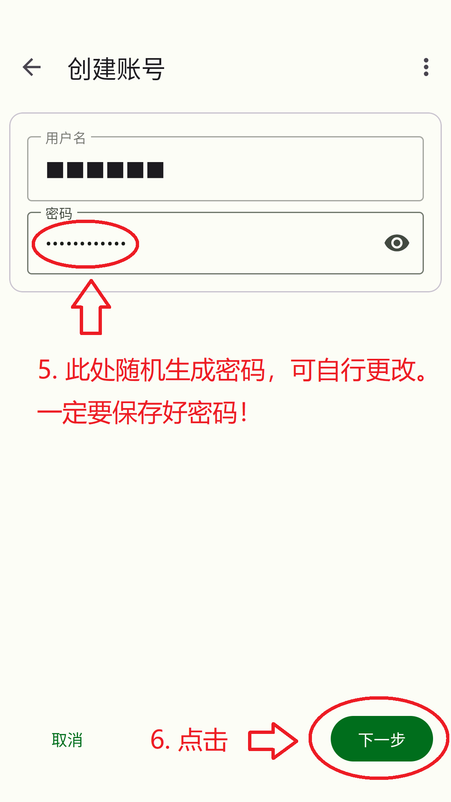

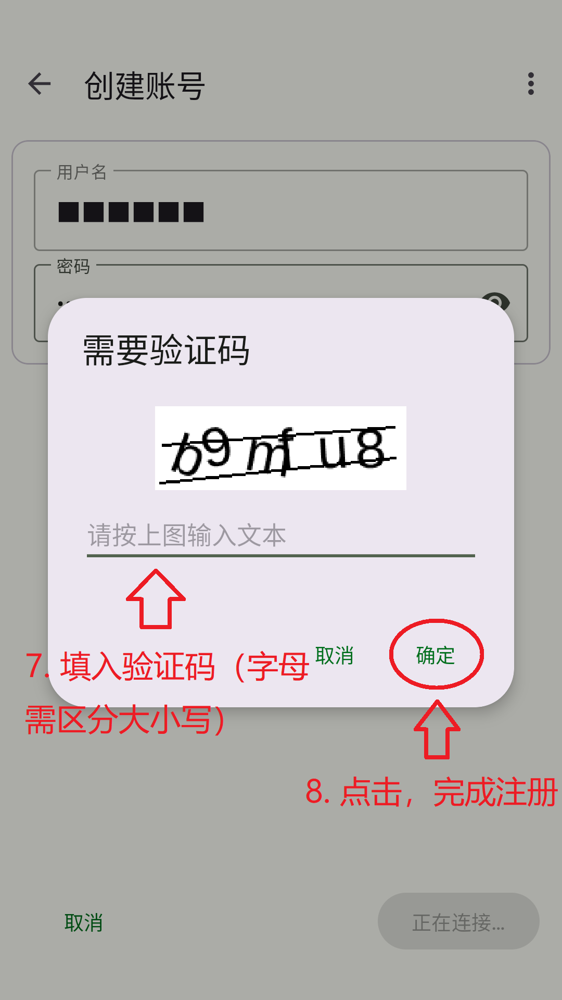

 

备份 OMEMO 密钥

OMEMO 密钥默认备份路径：/storage/emulated/0/Download/Conversations/Backup/

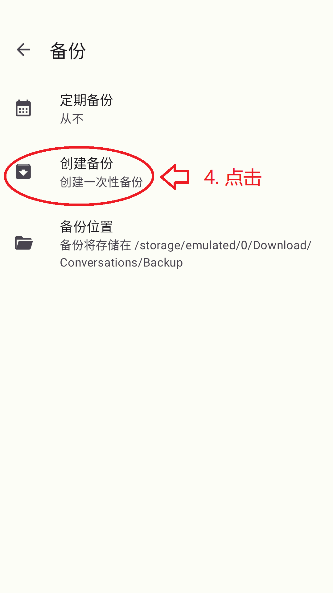

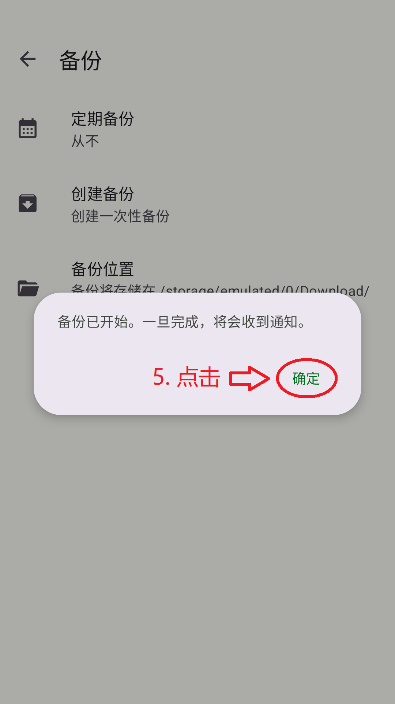

 

恢复 OMEMO 密钥

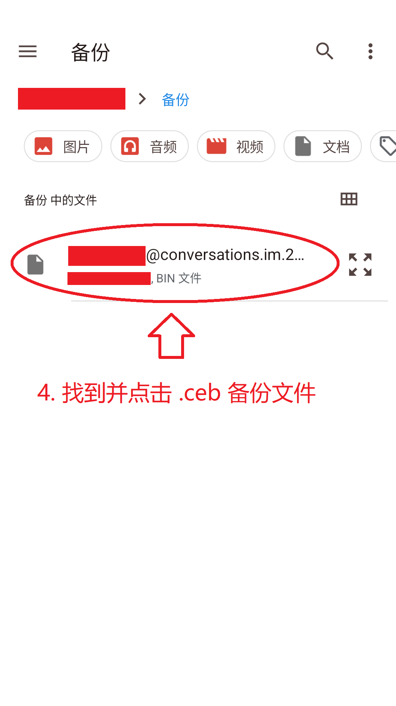

 

备份 / 恢复其他文件

文本信息存在服务器上，但图片、视频、文档、音频等文件是存在本地的。以下是各个 con 文件路径：

图片：/storage/emulated/0/Pictures/Conversations/

视频：/storage/emulated/0/Movies/Conversations/

其他文件（文档、音频等）：/storage/emulated/0/Download/Conversations/

迁移数据时备份文件夹，恢复数据时把文件夹复制到对于位置即可

 **Nekogram**   
第三方 [ **Telegram**](https://telegram.org/android?setln=en) 即时通信软件 
客户端开源，但服务端未开源。且注册强制绑定手机号 :( 
[官网](https://nekogram.app/download) / [Github Releases ](https://github.com/Nekogram/Nekogram/releases)

> 登陆这第三方客户端，先要在某个设备上登陆 Telegram 账号，用账号里收验证码。

 

### 📬 邮箱

 **K-9 Mail**  
电子邮箱客户端，旨替代各平台官方邮箱客户端 
[官网](https://k9mail.app/download) / [Github Releases ](https://github.com/thunderbird/thunderbird-android/releases) / [F-Droid ](https://f-droid.org/packages/com.fsck.k9/) 
[维基百科 ](https://en.m.wikipedia.org/wiki/K-9_Mail) / [粉碎棱镜⚡推荐](https://prism-break.org/zh-CN/projects/k-9-mail/)

邮箱账号怎么登陆 K-9 Mail？

不论 QQ 邮箱、Gmail、Outlook、Yahoo Mail，还是自己搭建的邮箱服务器，只要开启 [POP3 ](https://zh.m.wikipedia.org/wiki/郵局協定) 或 [IMAP ](https://zh.m.wikipedia.org/wiki/因特网信息访问协议) 协议，账号就能在  **K-9 Mail** 客户端登陆。

 **Tuta Mail**   
端到端加密的电子邮箱，注册无需手机号与邮箱 
[官网](https://tuta.com/zh-hans) / [Github Releases ](https://github.com/tutao/tutanota/releases) / [F-Droid ](https://f-droid.org/packages/de.tutao.tutanota/) 
[维基百科 ](https://zh.m.wikipedia.org/wiki/Tuta)

 > 出于安全原因，**Tuta Mail** 不支持 IMAP / POP3 / [SMTP ](https://zh.m.wikipedia.org/wiki/简单邮件传输协议) 协议。详见[官方回答](https://tuta.com/zh-hans/support/howto#imap)

 

***

### 🏪 软件商店

注：以下两个版本软件商店任选一个即可

 **F-Droid Basic**  
基于  **F-Droid** 的开源软件商店，在 Android 12及以上可以静默更新 
[GitLab 源代码 ](https://gitlab.com/fdroid/fdroidclient) / [F-Droid ](https://f-droid.org/packages/org.fdroid.basic/) 
[维基百科 ](https://zh.m.wikipedia.org/wiki/F-Droid) / [粉碎棱镜⚡推荐](https://prism-break.org/zh-CN/projects/f-droid/)

 **Neo Store**  
基于  **F-Droid** 的开源软件商店，界面更美观简洁 
[Github Releases ](https://github.com/NeoApplications/Neo-Store/releases) / [F-Droid ](https://f-droid.org/packages/com.machiav3lli.fdroid/)

> 这个运行不怎么稳定，时不时卡顿，安装软件要点好几下才装上。不知其他设备会不会出现和我一样的问题。

F-Droid 添加储存库

依次点开「设置」→「储存库」→ 右下角「+」→「手动输入仓库 URL」，把储存库 URL 粘贴后点「添加」，完成。

我推荐的储存库：

IzzyOnDroid：[URL](https://apt.izzysoft.de/fdroid/repo)

清华大学 F-Droid 镜像站：[URL](https://mirrors.tuna.tsinghua.edu.cn/fdroid/repo/?fingerprint=43238D512C1E5EB2D6569F4A3AFBF5523418B82E0A3ED1552770ABB9A9C9CCAB)

> 参考：[ F-droid 清华大学开源软件镜像站](https://mirrors.tuna.tsinghua.edu.cn/help/fdroid/)

 

 

### 🚩 第三方开源平替

 **Newpipe**   
第三方 Youtube 视频播放器 
[官网](https://newpipe.net/) / [Github Releases ](https://github.com/TeamNewPipe/NewPipe/releases) / [F-Droid ](https://f-droid.org/packages/org.schabi.newpipe/) 
[维基百科 ](https://zh.m.wikipedia.org/wiki/NewPipe)

 **Pipepipe**   
第三方 Youtube、Bilibili、Niconico 视频播放器 
[官网](https://pipepipe.dev/) / [Github Releases ](https://github.com/InfinityLoop1308/PipePipe/releases) / [F-Droid ](https://f-droid.org/packages/InfinityLoop1309.NewPipeEnhanced/)

 **Aurora Store**   
第三方 Play 商店客户端 
[官网](https://aurorastore.org/) / [Github 源代码 ](https://github.com/whyorean/AuroraStore) / [F-Droid ](https://f-droid.org/packages/com.aurora.store/)

 **贴吧 Lite** 
第三方百度贴吧 
[Github Releases ](https://github.com/HuanCheng65/TiebaLite/releases)

> 该项目在 2024年2月17日归档。

 **Shaft**  
第三方 Pixiv 客户端 
[Github Releases ](https://github.com/CeuiLiSA/Pixiv-Shaft/releases)

 **Hydrogen**   
第三方知乎客户端 
[官网](https://huajiqaq.github.io/myhydrogen/) / [Github 源代码 ](https://github.com/huajiqaq/Hydrogen/)

 **蓝云** 
第三方蓝奏云客户端 
[官方蓝奏云链接](https://lanzoux.com/b083z1nsj)

一些牢骚

以前蓝云是有 App Center  源代码仓库的，但现在好像被作者删了。作者只发布在蓝奏云上。

蓝奏云目前不支持注销账号，请谨慎注册！

推荐用国外匿名上传文件网站来分享文件，而不是中国大陆的网盘！详见：[中国大陆网盘列表  ](https://zh.m.wikipedia.org/wiki/中国大陆网盘列表)

 

***

### 🌐 浏览器

 **Via** 
简洁占用小的浏览器 
[官网](https://viayoo.com/zh-cn/) / [Github 源代码 ](https://github.com/tuyafeng/Via) 
[维基百科 ](https://zh.m.wikipedia.org/wiki/Via%E6%B5%8F%E8%A7%88%E5%99%A8)

 **Fennec**  
基于   **Firefox** 的浏览器，去除了非自由扩展 
[Mercurial 源代码 ](https://hg-edge.mozilla.org/mozilla-central/file/tip/mobile/android) / [F-Droid ](https://f-droid.org/en/packages/org.mozilla.fennec_fdroid/) 
[粉碎棱镜⚡推荐](https://prism-break.org/zh-CN/projects/fennec-f-droid/)

🦊 Fenner 安全设置

 

搜索

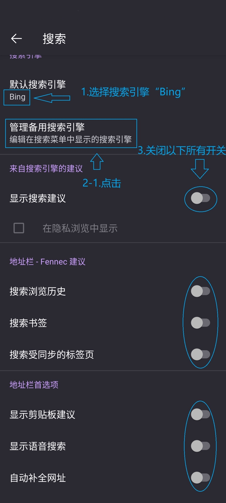

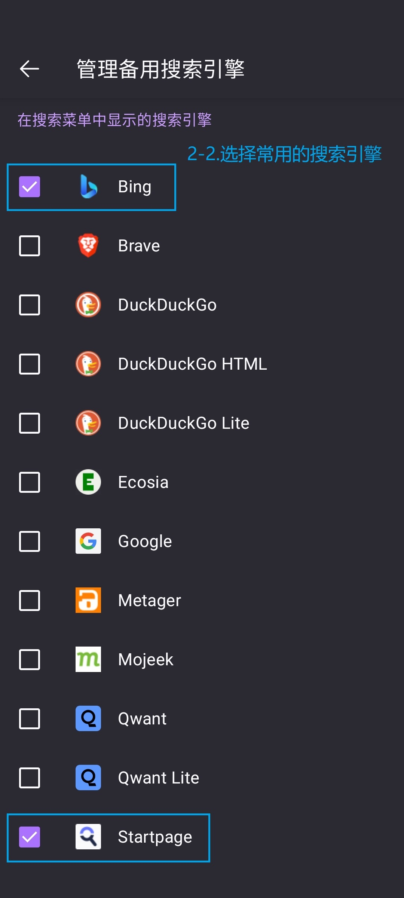

 

标签页

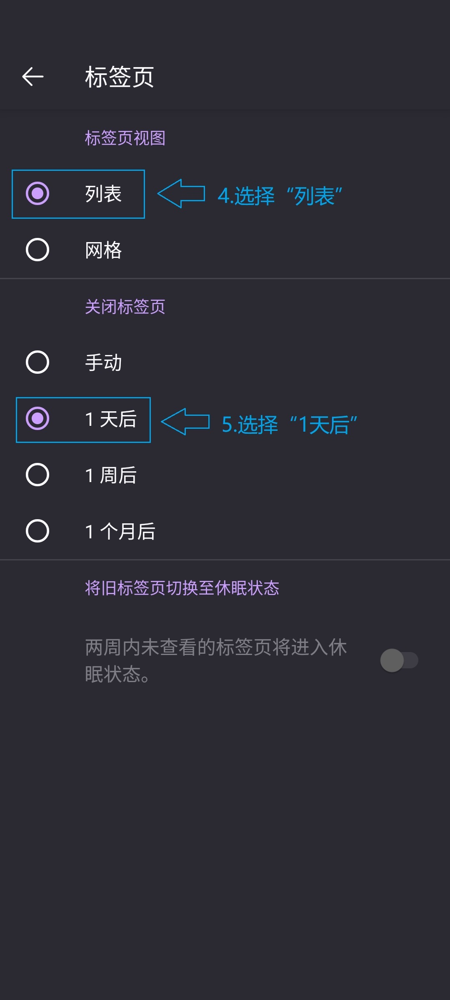

 

主页

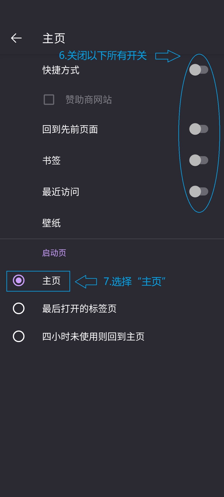

 

定制

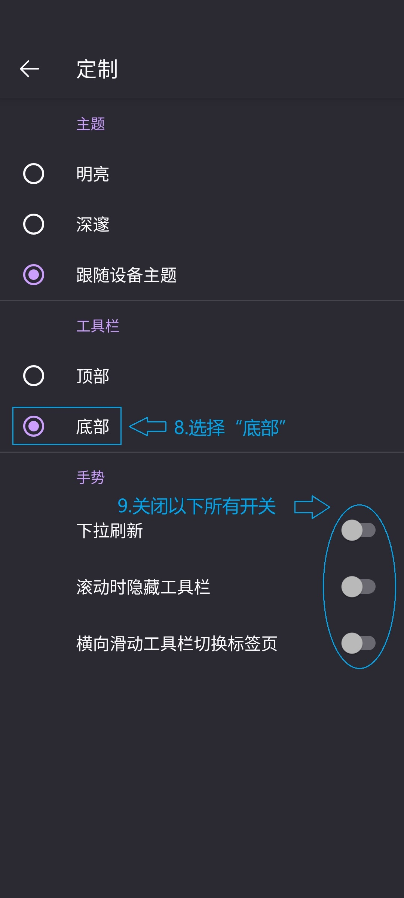

 

Logins and Passwords

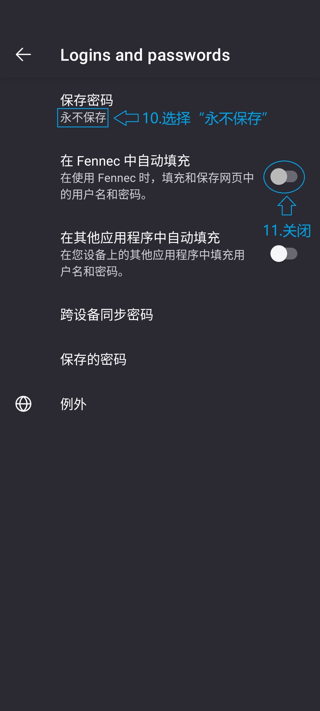

 

付款方式

 

无障碍环境

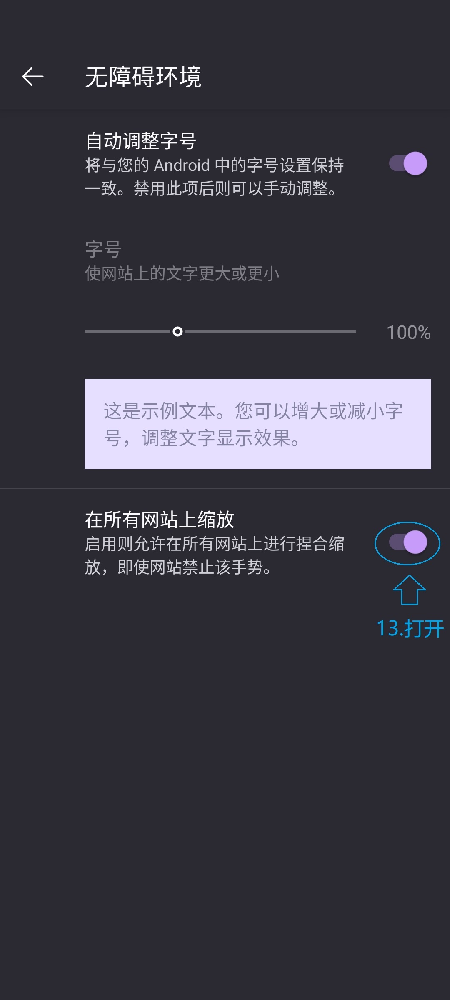

 

隐私浏览

 

HTTPS-Only 模式

 

增强型跟踪保护

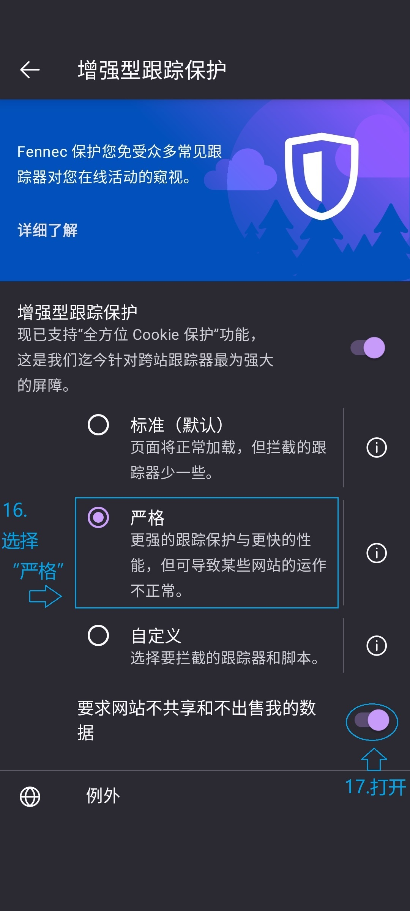

 

退出时删除浏览数据

 

用外部应用打开链接

 

安装扩展

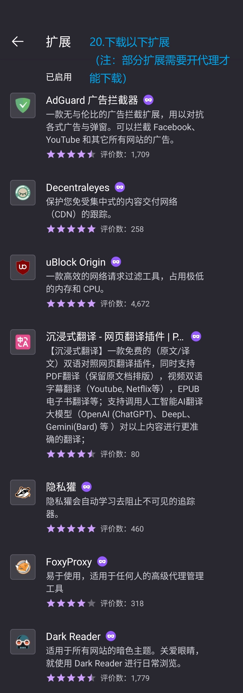

 

首页进入「隐私模式」

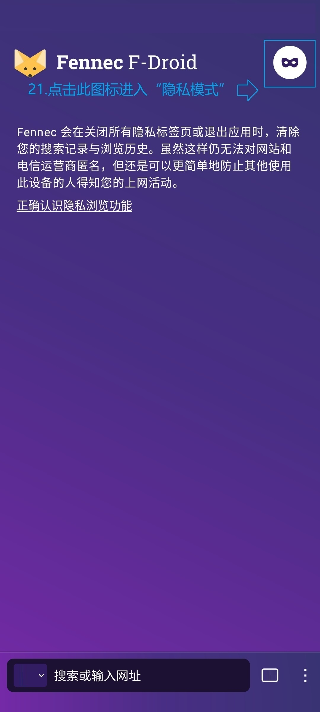

 

🦊 移动端 Firefox 离线安装扩展

前提：Firefox 版本不能低于 123

在 Firefox 首页依次点击右下角「⠇」→「设置」→「关于 Firefox」（如果浏览器是 Fenner 则为 「关于 Fennec」），连续点击 Firefox 徽标几下，直到提示「己启用调试菜单」。然后退出去，找到并点击「从文件安装扩展」，导入 .xpi 文件即可。

 **Tor Browser**  
基于  **Firefox** 的匿名浏览器，自带扩展  **NoScript** 
[官网](https://www.torproject.org/zh-CN/download/#android) / [GitLab 源代码 ](https://gitlab.torproject.org/tpo/core/tor/) 
[维基百科 ](https://zh.m.wikipedia.org/wiki/Tor) / [粉碎棱镜⚡推荐](https://prism-break.org/zh-CN/projects/tor-browser/)

🌰 如何使用 Tor Browser / 洋葱浏览器翻墙？

Tor Browser 的作用是匿名上网，但在屏蔽 Tor 网络的地区（中国大陆、俄罗斯、伊朗等）无法正常使用。官方推出的网桥可以在封锁地区连接 Tor 网络，其中 meek 网桥可以实现「永不被封」（缺点是**网速极慢**，只推荐在其他代理工具无法使用的情怳下**应急**）

在首页点击右上角齿轮图标，找到「配制网桥」，打开「使用网桥」，并在下面选择「meek-azure」，最后回到首页点击「连接」等待 Tor Browser 连接 Tor 网络。（连接过程极长！请保持耐心）

但不要以为连上 Tor 网络就高枕无忧了，还要担心「蜜罐节点」（尤其是中国大陆、香港、澳门的蜜罐节点！！！）但目前安卓端的 Tor Browser 无法修改国家节点，所以请务必谨慎使用！

推荐阅读：

编程随想《[“如何翻墙”系列：关于 Tor 的常见问题解答](https://program-think.blogspot.com/2013/11/tor-faq.html)》里的《[【隐私】相关的问题](https://program-think.blogspot.com/2013/11/tor-faq.html#head-5)》

拾风记博客《[从国产浏览器到 Tor Browser—— 该如何选择、配置及使用？](https://pickwind.github.io/2022/07/3040192682/)》里的《[三、Tor Browser 浏览器的安装、配置及使用](https://pickwind.github.io/2022/07/3040192682/#h3)》

> 注：以上博文只介绍桌面端的 Tor Browser 修改，没有移动端

 

### 📍 浏览器扩展

推荐阅读：

编程随想《[如何防止黑客入侵[5]：Web相关的防范（上） ](https://program-think.blogspot.com/2012/08/howto-prevent-hacker-attack-5.html?m=1)》的《[★如何选择插件和扩展？](https://program-think.blogspot.com/2012/08/howto-prevent-hacker-attack-5.html?m=0#head-4)》

 **Tampermonkey / 篡改猴**  
自定义网页工具，同[油猴  ](https://zh.m.wikipedia.org/wiki/Greasemonkey) 
[官网](https://www.tampermonkey.net/index.php?browser=firefox&locale=zh) / [Github 源代码 ](https://github.com/Tampermonkey/tampermonkey) / [Firefox ](https://addons.mozilla.org/zh-CN/android/addon/tampermonkey/) 
[维基百科 ](https://zh.m.wikipedia.org/wiki/%E7%AF%A1%E6%94%B9%E7%8C%B4)

脚本推荐

用户脚本网站 [Greasy Fork ](https://greasyfork.org/zh-CN)

[修复“编程随想（阮晓寰）”部落格评论无法显示及评论的问题](https://greasyfork.org/zh-CN/scripts/463052-修复-编程随想-阮晓寰-部落格评论无法显示及评论的问题)

 **Dark Readed** 显示网页暗色主题 [官网](https://darkreader.org/) / [Github Releases ](https://github.com/darkreader/darkreader/releases) / [Firefox ](https://addons.mozilla.org/en-US/firefox/addon/darkreader/)

 **沉浸式翻译** 双语对照网页翻译 [官网](https://immersivetranslate.com/zh-Hans/) / [Github Releases ](https://github.com/immersive-translate/immersive-translate/releases) / [Firefox ](https://addons.mozilla.org/zh-CN/firefox/addon/immersive-translate/)

> 新版不开源，[旧版扩展](https://github.com/immersive-translate/old-immersive-translate)己归档

 **SingleFile**  
将网页保存到一个 html 文件的扩展 
[官网](https://www.getsinglefile.com/) / [Github 源代码 ](https://github.com/gildas-lormeau/SingleFile) / [Firefox ](https://addons.mozilla.org/zh-CN/firefox/addon/single-file/?utm_source=addons.mozilla.org&utm_medium=referral&utm_content=search)

> 用 Firefox 自带的保存网页功能（也就是「另存网页为...」）保存一个网页，会在本地保存一个文件夹和一个 html 文件，很不简洁 :(

**以下是隐私保护扩展**

 **uBlock Origin**  
移除所有广告和网站追踪器 
[官网](https://ublockorigin.com/zh) / [Github Releases ](https://github.com/gorhill/uBlock/releases) / [Firefox ](https://addons.mozilla.org/zh-CN/android/addon/ublock-origin/) 
[维基百科 ](https://zh.m.wikipedia.org/wiki/UBlock_Origin) / [粉碎棱镜⚡推荐](https://prism-break.org/zh-CN/projects/ublock-origin/)

 **Privacy Badger / 隐私獾**  
阻止不遵守 [DNT ](https://zh.m.wikipedia.org/wiki/%E8%AF%B7%E5%8B%BF%E8%BF%BD%E8%B8%AA) 协议的广告商跟踪行为 
[官网](https://privacybadger.org/zh-cn/) / [Github 源代码 ](https://github.com/EFForg/privacybadger) / [Firefox ](https://addons.mozilla.org/zh-CN/android/addon/privacy-badger17/) 
[维基百科 ](https://zh.m.wikipedia.org/wiki/%E9%9A%90%E7%A7%81%E7%8D%BE) / [粉碎棱镜⚡推荐](https://prism-break.org/zh-CN/projects/privacy-badger/)

 **Decentraleyes**  
保护用户免遭集中的 [CDN ](https://zh.m.wikipedia.org/wiki/%E5%85%A7%E5%AE%B9%E5%82%B3%E9%81%9E%E7%B6%B2%E8%B7%AF) 的跟踪 
[官网](https://decentraleyes.org/) / [Github Releases ](https://github.com/Synzvato/decentraleyes/releases) / [Firefox ](https://addons.mozilla.org/zh-CN/firefox/addon/decentraleyes/) 
[维基百科 ](https://zh.m.wikipedia.org/wiki/Decentraleyes) / [粉碎棱镜⚡推荐](https://prism-break.org/zh-CN/projects/decentraleyes/)

> 该扩展于2018年6月8日在 Github 归档

 **NoScript**  
以白名单选择性执行 [JavaScript ](https://zh.m.wikipedia.org/wiki/JavaScript)、[Java ](https://zh.m.wikipedia.org/wiki/Java)、[Flash ](https://zh.m.wikipedia.org/wiki/Adobe_Flash)、[Sliverlight ](https://zh.m.wikipedia.org/wiki/Microsoft_Silverlight) 以及其它插件和脚本内容 
[官网](https://noscript.net/) / [Github Releases ](https://github.com/hackademix/noscript/releases) / [Firefox ](https://addons.mozilla.org/zh-CN/android/addon/noscript/) 
[维基百科 ](https://zh.m.wikipedia.org/wiki/NoScript) / [粉碎棱镜⚡推荐](https://prism-break.org/zh-CN/projects/noscript/)

 

### 🔍 搜索引擎

 **DuckDuckGo**  
匿名、无记录的 Web 搜索 
[URL](https://duckduckgo.com/) / [Github 源代码 ](https://github.com/duckduckgo/duckduckgo) 
[维基百科 ](https://zh.m.wikipedia.org/wiki/DuckDuckGo) / [粉碎棱镜⚡推荐](https://prism-break.org/zh-CN/projects/duckduckgo/)

 **Startpage**  
保护隐私的搜索引擎，使用 Google 搜索 API 
[URL](https://www.startpage.com/) 
[维基百科 ](https://zh.m.wikipedia.org/wiki/Startpage) / [粉碎棱镜⚡推荐](https://prism-break.org/zh-CN/subcategories/gnu-linux-web-search)

> 推荐阅读：编程随想《[Startpage——保护隐私的搜索引擎，搜索质量等同 Google ](https://program-think.blogspot.com/2018/11/Private-Search-Engine-Startpage.html)》

🔍 浏览器添加搜索引擎

 
 **Via 浏览器** 依次打开「设置」→「通用」→「搜索引擎」→右上角「+」，分别在弹窗里的「标题处」与「地址处」填搜索引擎名称与 URL（URL 后面还要添加「search?q=」字符）。

 **Firefox** /  **Fenner** 依次打开右下角三点→「设置」→「搜索」→「管理备用搜索引擎」→「+ 添加搜索引擎」，分别在「名称」与「搜索字符串网址」填名称与 URL（URL 后面要添加「/search?q=%s」字符）。

其他浏览器请自行找方法。

 

***

### 🧩 系统补丁

 **Pixel Sound / Pixel 音效** 
Pixel OS 系统铃声集合 
没有官网

 **Twilight / 薄暮微光** 
屏幕调光、防蓝光护眼工具 
[官网](https://twilight.urbandroid.org/) / [Play 商店 ](https://play.google.com/store/apps/details?id=com.urbandroid.lux)

 **fooView / FV悬浮球** 
多功能悬浮球 
一般最常用的功能是提取屏幕文字 
[官网](https://www.fooview.com/)

 **短信验证码自动复制**  
自动复制短信验证码工具 
[Github Releases ](https://github.com/jd1378/otphelper/releases) / [F-Droid ](https://f-droid.org/zh_Hans/packages/io.github.jd1378.otphelper/index.html)

 **Cache Cleaner**  
缓存清理器 
[Github Releases ](https://github.com/bmx666/android-appcachecleaner/releases) / [F-Droid ](https://f-droid.org/packages/com.github.bmx666.appcachecleaner/)

 

### ✨ 美观

 **Niagara Launcher** 
专为单手操作的**桌面启动器** 
[官网](https://niagaralauncher.app/) / [Github Releases ](https://github.com/8bitPit/Niagara-Issues/releases)

 **Kvaesitso**  
专注于搜索的**桌面启动器** 
[官网](https://kvaesitso.mm20.de/) / [Github Releases ](https://github.com/MM2-0/Kvaesitso/releases) / [F-Droid ](https://f-droid.org/packages/de.mm20.launcher2.release/)

 **Arcticons**  
单调线条风格**图标包** 
[官网](https://arcticons.com/) / [Github Releases ](https://github.com/Arcticons-Team/Arcticons/releases) / [F-Droid ](https://f-droid.org/packages/com.donnnno.arcticons.daynight/)

>  **Arcticons** 图标包适用于  **Niagara Launcher** &  **Kvaesitso** 桌面启动器

 

### 📥 下载器

 **Gopeed**  下载器 [官网](https://gopeed.com) / [Github Releases ](https://github.com/GopeedLab/gopeed/releases)

 **Download Navi**  下载器 [Github Releases ](https://github.com/TachibanaGeneralLaboratories/download-navi/releases) / [F-Droid ](https://f-droid.org/en/packages/com.tachibana.downloader/)

>  **Download Navi** 更轻量，但其最后一次更新是在2022年3月15日。

 

### 📎 其他

 **Binary Eye**  
条形码、二维码扫描器 
[Github Releases ](https://github.com/markusfisch/BinaryEye/releases) / [F-Droid ](https://f-droid.org/en/packages/de.markusfisch.android.binaryeye/)

 **GKD**  
基于无障碍、高级选择器、订阅规则的自定义屏幕点击工具 
[官网](https://gkd.li/guide/) / [Github Releases ](https://github.com/gkd-kit/gkd/releases)

 **Klick'r - Smart AutoClicker**  
开源连点器，代替垃圾软件  **自动点击器** 
[Github Releases ](https://github.com/Nain57/Smart-AutoClicker/releases) / [F-Droid ](https://f-droid.org/packages/com.buzbuz.smartautoclicker/)

 **AdGuard**  
跨平台内容过滤、广告拦截、隐私保护工具 
[官网](https://adguard.com/en/welcome.html) / [Github Releases ](https://github.com/AdguardTeam/AdguardForAndroid/releases) 
[维基百科 ](https://zh.m.wikipedia.org/wiki/AdGuard)

 **Currencies**  
汇率转换计算器 
[Github Releases ](https://github.com/sal0max/currencies/releases) / [F-Droid ](https://f-droid.org/packages/de.salomax.currencies)

 

***

### 🪜 翻墙工具

推荐阅读：[编程随想的 Blog（桌面端）](https://program-think.blogspot.com/p/search.html?m=0)右侧「推荐帖子（翻墙技术）」相关博文，但服务于桌面端，移动端极少。

翻墙很折腾，但不要因此放弃自由的互联网，被墙国局域网**体制化**！（相关博文：《[谈谈【体制化】，并推荐《肖申克的救赎》](https://program-think.blogspot.com/2010/11/institutionalize.html)》）强烈推荐阅读编程随想的《[学习一下德国人民的翻墙精神](https://program-think.blogspot.com/2009/07/break-through-berlin-wall.html)》，德国人为争得自由用生命翻柏林墙，我们翻 [GFW ](https://zh.m.wikipedia.org/wiki/%E9%98%B2%E7%81%AB%E9%95%BF%E5%9F%8E) 遇到的困难又如何？

 

 **Clash Meta for Android**   
Android 代理工具 
[Github Releases ](https://github.com/MetaCubeX/ClashMetaForAndroid/releases) / [F-Droid ](https://f-droid.org/packages/com.github.metacubex.clash.meta/)

 **V2RayNG**   
Android 代理工具 
[官网](https://v2rayng.org/v2rayng-download/) / [Github Releases ](https://github.com/2dust/v2rayNG/releases) 
[维基百科 ](https://zh.m.wikipedia.org/wiki/V2Ray)

🎄 公益免费 v2ray 节点（每日更新）： 
[Github - 1 ](https://github.com/aiboboxx/v2rayfree) / [Github - 2 ](https://github.com/Aclashv2rayfree/freevpn)

代理工具防 DNS 泄露设置

参考：不良林 [进阶•DNS泄漏篇 ](https://m.youtube.com/watch?v=fqREM6b25SY) / [DNS leak / DNS 泄露 ](https://en.m.wikipedia.org/wiki/DNS_leak)

 **V2RayNG**： 依次点击左上角「≡」→「设置」，在「VPN 设置」下勾选「启动本地 DNS」与「启动虚拟 DNS」，在「路由设置」下的「域名策略」选择「AsIs」，「预定义规则」选择「绕过局域网及大陆地址而后代理」，其他配置默认即可。重连规则即生效。

 **Clash Meta for Android**： 依次点击「设置」→「覆写」，在「DNS」下的「策略」选择「强制启动」，「增强模式」选择「Fake-IP 至 域名映射」，「Name Server」里添加 中国大陆的 DNS 服务器 IPv4 地址，配制完成。

中国大陆 DNS 服务器 IPv4 地址例表

| DNS 服务提供商 | 首选地址 | 备用地址 |
| --- | --- | --- |
| 114DNS | 114.114.114.114 | 114.114.115.115 |
| 阿里公共DNS | 223.5.5.5 | 223.6.6.6 |
| oneDNS | 117.50.10.10 | 52.80.52.52 |
| 360 Public DNS（电信 & 移动宽带） | 101.226.4.6 | 218.30.118.6 |
| 360 Public DNS（联通宽带） | 123.125.81.6 | 140.207.198.6 |
| CNNIC sDNS | 1.2.4.8 | 210.2.4.8 |
| ... | ... | ... |

 **Proton VPN**   
由瑞士公司 Proton Technologies AG 运营的 VPN 服务 
[官网](https://protonvpn.com/download-android) / [Github Releases ](https://github.com/ProtonVPN/android-app/releases) / [F-Droid ](https://f-droid.org/packages/ch.protonvpn.android/) 
[维基百科 ](https://zh.m.wikipedia.org/wiki/ProtonVPN)

 **迷雾通**  
抵御运营商级别审查的 VPN 
[官网](https://geph.io/zhs) / [Github 源代码 ](https://github.com/geph-official/geph4-client) / [官方免翻墙镜像](https://f001.backblazeb2.com/file/geph4-dl/geph-releases/dl.html)

 **WireGuard**  
自由开源的加密 VPN 工具 
[官网](https://www.wireguard.com/install/) / [Github 源代码 ](https://github.com/WireGuard/wireguard-android) 
[维基百科 ](https://zh.m.wikipedia.org/wiki/WireGuard) / [粉碎棱镜⚡推荐](https://prism-break.org/zh-CN/projects/wireguard/)

 **FreeBrowser / 自由浏览** 
基于  **Chrome** 定制，专为打破信息封锁的代理浏览器 
[官网１](https://freebrowser.org/) / [官网２（推荐）](http://45.79.105.210/zh) 
[维基百科 ](https://zh.m.wikipedia.org/wiki/%E8%87%AA%E7%94%B1%E6%B5%8F%E8%A7%88)

 **自由门** 
打破信息封锁的代理工具 
[官网](http://dongtaiwang.com/loc/download.php) 
[维基百科 ](https://zh.m.wikipedia.org/wiki/%E8%87%AA%E7%94%B1%E9%97%A8)

 

💸 免费获得代理工具和节点的经验总结

1. Web 代理： 在浏览器搜索「web代理」。但免费的 Web 代理难免会有广告。

2. 免费机场节点： 常用的代理工具有  **V2RayNG**、 **Clash Meta for Android**、 **Nekobox** 等。在**浏览器**或 **Youtube** 搜「20XX年X月X日免费机场节点」，下好节点导入代理工具。速度有快有慢。
    > 这个方法有风险，因为机场主能看到使用者的机场账号、使用时间、IP、访问的网站等信息。详见：[不良林 - 实战演示机场搭建运作原理 ](https://youtu.be/KfOEabr38WU/?t=0h13m57s)
    > 
    > 更糟糕的可能会得到钓鱼节点！详见：[不良林 - 免费节点钓鱼 ](https://youtu.be/vuF6rDLp3pg)
    > 
    > 若特别在乎隐私就自己搭建节点。

3.  **WireGuard** 隧道： 由于优选 IP 后配置的隧道已经不能用了，所以只能用别人配置好的隧道。比如[翻墙公益](https://github.com/w1g2)。速度时快时慢，而且游戏玩不了的。过期了再搞个新的。（建议直接访问不要开代理「[直链](https://45.79.165.151/)」）

4. GreatFire 工具： [GreatFire 官方](https://zh.greatfire.org/)提供的  **FreeBrowser**

5. VPN： 目前开源免费的 VPN 很少，就只有  **Proton VPN**、 **迷雾通**还能用。但登录帐号要开代理，而且速度不快，迷雾通的免费账户限速125kb/s。

 

修改 Android 设备 DNS

> 由于各个 Android 系统的设置界面各有差异，本次以  LineageOS 21 为例，其他系统自行查找方法。
> 
> 参考：不良林 [进阶•DNS泄漏篇 ](https://m.youtube.com/watch?v=fqREM6b25SY)

依次打开「设置」→「网络和互联网」→「互联网」，点击当前使用的 WIFI 或运营商旁点击右侧齿轮图标，再点击右上角的编辑图标，在弹窗里展开「高级选项」，IP 设置选择「静态」，最后修改「DNS 1」与「DNS 2」，完成。

海外 DNS 服务器推荐：

| DNS 服务提供商 | 首选地址 | 备用地址 |
| --- | --- | --- |
| Google | 8.8.8.8 | 8.8.4.4 |
| IBM Quad9 | 9.9.9.9 | 149.112.112.112 |
| OpenDNS | 208.67.222.222 | 208.67.220.220 |
| Cloudflare | 1.1.1.1 | 1.0.0.1 |
| AdGuard | 94.140.14.14 | 94.140.15.15 |
| 台湾中华电讯 | 168.95.192.1 | 168.95.192.2 |
| 诺顿（安全） | 199.85.126.10 | 199.85.127.10 |
| ... | ... | ... |

 

***

### 🛠️ 搞机 -  一般

 **LibChecker**  
查看应用使用的第三方库工具 
[Github Releases ](https://github.com/LibChecker/LibChecker/releases) / [F-Droid ](https://f-droid.org/packages/com.absinthe.libchecker/)

> 推荐下载 Foss 版。

 **DevCheck** 
检验设备硬件和软件工具 
[官网](https://devcheck.app/) / [Play 商店 ](https://play.google.com/store/apps/details?id=flar2.devcheck&hl=en_US)

 **TrebleCheck**  
安卓手机兼容性检测工具 
[Github Releases ](https://github.com/kevintresuelo/treble/releases)

 **白眼** 
手机跑分、甄别工具 
[官网](https://epcdiy.org/download1.html)

 **Termux**  
终端模拟器，兼容 ADB & ROOT 模式 
[官网](https://termux.dev/en/) / [Github Releases ](https://github.com/termux/termux-app/releases) / [F-Droid ](https://f-droid.org/packages/com.termux/) 
[维基百科 ](https://zh.m.wikipedia.org/wiki/Termux_(软件))

 **隐秘参数** 
显示安卓手机内部组件信息工具 
[Github Releases ](https://github.com/x1y9/x1y9.github.io/releases/tag/com.x1y9.probe)

 

### 🛠️ 搞机 - ADB

> 注：以下工具要先激活  **Shizuku** 才能用。 以下工具除  **App Ops** 以外都兼容 ROOT 模式。

 **Shizuku**  
ADB 工具 
[官网](https://shizuku.rikka.app/) / [Github Releases ](https://github.com/RikkaApps/Shizuku/releases)

 **Hail** / **雹**   
冻结 APP工具 
[Github Releases ](https://github.com/aistra0528/Hail/releases) / [F-Droid ](https://f-droid.org/packages/com.aistra.hail/)

 **InstallerX**   
安装器 
[Github Releases ](https://github.com/iamr0s/InstallerX/releases)

 **App Ops** 
安卓权限控制工具 
[官网](https://appops.rikka.app/zh-hans/) / [Github Releases ](https://github.com/RikkaApps/App-Ops-issue-tracker/releases)

 **SystemUI Tuner**  
查看和修改 Android 设备上的隐藏设置 
[Github Releases ](https://github.com/zacharee/Tweaker/releases)

 **Scene** 
进程管理、性能调教、耗电统计工具 
[官网](http://vtools.omarea.com/#/)

 **黑阈** 
管理后台 APP 工具 
[官网](https://jianyv.com/br/) / [官方文档](https://dl.jianyv.com/br/br.pdf)

 

### 🛠️搞机 -  ROOT

 **Magisk**  
ROOT 工具 
[官网](https://magisk.me/) / [Github Releases ](https://github.com/topjohnwu/Magisk/releases) 
[维基百科 ](https://zh.m.wikipedia.org/wiki/Magisk)

 **Kitsune Magisk**  
 **Magisk** 的第三方，比它多了 ROOT 授权白名单功能 
[Github Releases ](https://github.com/HuskyDG/magisk-files/releases)

 **Thanox / 灭霸**  
系统管理工具，需购买激活码 
[官网](https://tornaco.github.io/Thanox-Docs/zh/) / [Github Releases ](https://github.com/Tornaco/Thanox/releases)

 **DataBackup / 数据备份**  
备份 App、文件工具 
[Github Releases ](https://github.com/XayahSuSuSu/Android-DataBackup/releases)

> 推荐下载 Foss 版。

 

***

> 正方形图标大小是**20xp*20xp**，长方形图标高度为**20xp**。
> 
> 遵循「Just do it」原则：点超链接跳转到下载界面

