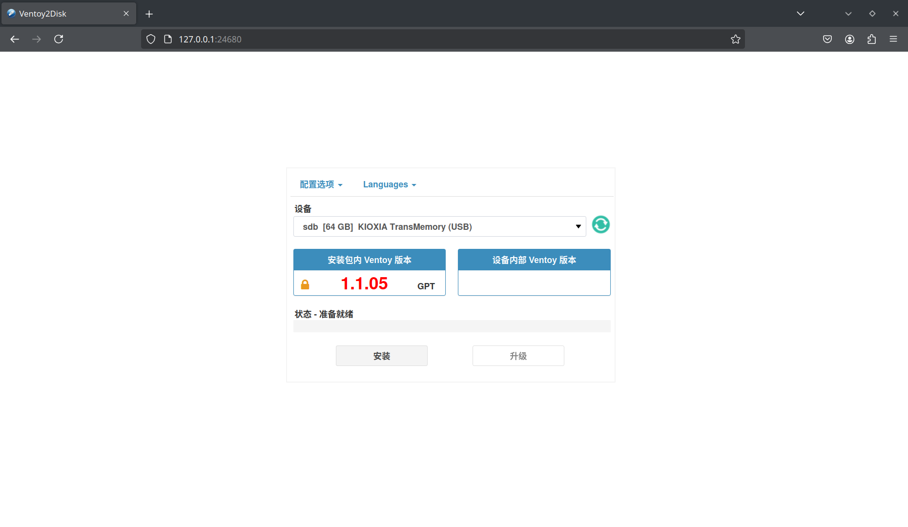

# Linux Softwre

### 📢 前提

如果你是第一次阅读此文档，并从未了解**软件许可证**，建议先看下面的「🪪 软件许可证」。下面的软件清单中大部分**开源 / 自由软件**都带有许可证。

🪪 软件许可证

[软件许可证 ](https://zh.m.wikipedia.org/wiki/%E8%BD%AF%E4%BB%B6%E8%AE%B8%E5%8F%AF%E8%AF%81) / [自由软件 ](https://zh.m.wikipedia.org/wiki/%E8%87%AA%E7%94%B1%E8%BD%AF%E4%BB%B6%E8%AE%B8%E5%8F%AF%E8%AF%81)

编程随想的《[澄清“自由软件、开源软件”相关概念及许可证的误解](https://program-think.blogspot.com/2019/03/Misunderstand-Free-and-Open-Source-Software.html)》、《[如何选择开源项目](https://program-think.blogspot.com/2009/02/how-to-choose-opensource-project.html)》
> 依靠**License（授权协议、许可证）**、技术层面的因素、**普及程度（用户的人气）**、**活跃程度（开发的人气）**、其它的风险 选择开源项目 （加粗的方法是**非技术者**能做到的）

 

| 许可证图标 | 许可证名称 |
| --- | --- |
|  | [GNU通用公共许可证 ](https://zh.m.wikipedia.org/wiki/GNU%E9%80%9A%E7%94%A8%E5%85%AC%E5%85%B1%E8%AE%B8%E5%8F%AF%E8%AF%81) |
|  | [GNU宽通用公共许可证 ](https://zh.m.wikipedia.org/wiki/GNU%E5%AE%BD%E9%80%9A%E7%94%A8%E5%85%AC%E5%85%B1%E8%AE%B8%E5%8F%AF%E8%AF%81) |
|  | [GNU Affero通用公共许可证 ](https://zh.m.wikipedia.org/wiki/GNU_Affero%E9%80%9A%E7%94%A8%E5%85%AC%E5%85%B1%E8%AE%B8%E5%8F%AF%E8%AF%81) |
|  | [BSD许可证 ](https://zh.m.wikipedia.org/wiki/BSD%E8%AE%B8%E5%8F%AF%E8%AF%81) |
|  | [Mozilla公共许可证 ](https://zh.m.wikipedia.org/wiki/Mozilla%E5%85%AC%E5%85%B1%E8%AE%B8%E5%8F%AF%E8%AF%81) |
|  | [Apache许可证 ](https://zh.m.wikipedia.org/wiki/Apache%E8%AE%B8%E5%8F%AF%E8%AF%81) |
|  | [MIT许可证 ](https://zh.m.wikipedia.org/wiki/MIT%E8%A8%B1%E5%8F%AF%E8%AD%89) |
|  | [公有领域 ](https://zh.m.wikipedia.org/wiki/%E5%85%AC%E6%9C%89%E9%A2%86%E5%9F%9F) |
|  | [WTFPL ](https://zh.m.wikipedia.org/wiki/WTFPL) |

 

📥 下载「.exe」、「.msi」等安装包的建议

优先选 **Github Releases**  下载「.exe」、「.msi」、「.zip」等文件。因为有些官网不提供「.exe」等文件。若没有 **Github Releases**  超链接就选官网。  (注意区分「**Github Releases** 」与「**Github 源代码** 」，后者只有源代码)

 

***

### 🐧 Gun/Linux 发行版

 **Debian** [DFSG 协议 ](https://zh.wikipedia.org/wiki/开源定义) [官网](https://www.debian.org/distrib/) / [仓库](https://salsa.debian.org/public) [维基百科 ](https://zh.m.wikipedia.org/wiki/Debian) / [粉碎棱镜⚡推荐](https://prism-break.org/zh-CN/projects/debian/)

安装 Debian 12 后要做的几件事

 

添加 / 更换国内软件源

离线安装的 Debian 没有软件源，所以要添加，否则无法用终端安装软件

- 切换 root 用户：

    su root

- 用 nano 编辑器打开配置文件：

    nano  /etc/apt/sources.list

    > Debian 自带 nano 编辑器，但没有 vim 编辑器。

- 注释原有软件源：

    在「deb cdrom: [Debian Gun/Linux ...」前面加「#」，使其失效

- 点击下面文档，添加若干软件源：

    [Debian软件源](linux-debian软件源.txt)

- 按 Ctlr + o ，再按 Enter 确认保存；最后按 Ctlr + x 退出。

- 最后更新软件，完成：

    apt update

    apt upgrade

- 退回用户账户：

    exit

参考：

[Debian 12 更换国内/本地源](https://www.cnblogs.com/smlile-you-me/p/17727308.html)

[Debian 执行apt-get update失败提示：请使用 apt-cdrom ...](https://blog.csdn.net/yimaoya/article/details/125345414)

[Debian 12 更换国内/本地源](https://www.cnblogs.com/smlile-you-me/p/17727308.html)

 

为用户添加 sudo 权限

Debian 默认没有 sudo，所以要切换 root 用户安装 sudo

- 切换 root 用户：

    su root

- 安装 sudo：

    apt install sudo

- 用 nano 编辑器打开配置文件：

    nano /etc/sudoers.d/username

- 添加以下内容（把 username 换成 用户名）：

    username ALL=(ALL)ALL

- 按 Ctlr + o ，再按 Enter 确认保存；最后按 Ctlr + x 退出，完成。

- 退回用户账户：

    exit

参考：

[Debian为用户添加sudo权限](https://zhuanlan.zhihu.com/p/357762683)

 

将 /home 里的中文文件夹名改成英文

为什么要换成英文？因为输指令时这几个路径最常用。指令是英文的，偏偏最常用的文件夹名是中文的。总是切换中英文输入不方便，所以就改成英文，一劳永逸。

- 用 nano 编辑器打开配置文件：

    nano ~/.config/user-dirs.dirs

- 把文件指向换掉

   XDG_DESKTOP_DIR="$HOME/desktop"
   XDG_DOWNLOAD_DIR="$HOME/download"
   XDG_TEMPLATES_DIR="$HOME/templates"
   XDG_PUBLICSHARE_DIR="$HOME/publicshare"
   XDG_DOCUMENTS_DIR="$HOME/documents"
   XDG_MUSIC_DIR="$HOME/music"
   XDG_PICTURES_DIR="$HOME/pictures"
   XDG_VIDEOS_DIR="$HOME/videos"

    > 原来的「$HOME/」后面是中文，现在要换成英文。

- 按 Ctlr + o ，再按 Enter 确认保存；最后按 Ctlr + x 退出，完成。

- 在 /home 里创建英文文件夹：

    mkdir desktop download templates publicshare documents music pictures videos

- 在 /home 里删除中文文件夹：

    rm -r 公共  模板  视频  图片  文档  下载  音乐  桌面

参考：

[将linux主文件夹/home里的中文文件夹名称改成英文](https://www.wenjinyu.me/change-linux-home-folder-chinese-to-english/)

 

 **Arch Linux**  [官网](https://archlinux.org/) / [GitLab 源代码 ](https://git.archlinux.org/) [维基百科 ](https://zh.m.wikipedia.org/wiki/Arch_Linux)

 

安装 Windows & Linux 双系统的注意事项

1. 先安装 Windows 10，再安装 Debian 12。（其他 Linux 发行版也一样）

2. 在安装系统前，先进 Bios，找到 SATA Mode 并选为 「AHCI」（其他主板 Bios 里可能没有这个名字，就找「Intel RST Premium」或「RAID」字眼，试着更换成「AHCI」）

    若不切换成「AHCI」，安装 Debian 时会识别不到硬盘。之后再切换，有可能会使 Windows 不能启动，这时只能重装 Windows。

    > 参考：[笔记本安装debian 12 失败——扫不到硬盘](https://forums.debiancn.org/t/topic/5230)

3. 最好下载 Debian 完整镜像。如果用网络镜像安装，系统文件将从镜像站下载。但有时即使选择国内镜像站，下载速度也很慢，下载时间会慢到几个小时甚至几天。

    如何识别网络镜像 / 完整镜像？若镜像名里带「netinst」则为网络镜像，而完整镜像大小在4G左右。

    怎么下载 Debian镜像？详见 [Debian 下载](https://www.debian.org/distrib/)。推荐用 BT 下载，因为国内镜像源下载速度不稳定。

4. 记得分区！Windows 分 C盘与 D盘，Linux 分根目录「/」与 home 目录「/home」。这么做可以把系统与数据分开，以后想重装系统只需格式化系统分区即可。

    以下是俺的分区（俺的硬盘容量为 1024GB。因为 Windows 俺很少用，主要用来应急，所以分配给 Windows 的空间很少）：

-  **Windows 10**：128GB 
    C盘：40GB（4096MB） 
    D盘：88GB（90112MB）

-  **Debian 12**：896GB 
    efi 分区：0.5GB（设为引导器设备）  
    Swap 分区：4GB 
    / （根目录）：100GB 
    /home（home 目录）：791.6GB

 

***

### ⌨️ 基础工具

 **LocalSend**  
局域网文件传输工具 
[官网](https://localsend.org/download) / [Github Releases ](https://github.com/localsend/localsend/releases)

 **KeePassXC**  
本地密码管理器，支持 Password / 口令、[Key File / 密钥文件 ](https://zh.m.wikipedia.org/wiki/密钥文件) 、硬件认证 
[官网](https://keepassxc.org/download/#linuxhttps://keepassxc.org/download/) / [Github Releases ](https://github.com/keepassxreboot/keepassxc/releases) 
[维基百科 ](https://zh.m.wikipedia.org/wiki/KeePassXC) / [粉碎棱镜⚡推荐](https://prism-break.org/zh-CN/projects/keepassxc/)

命令安装

 **Debian** Basic：sudo apt install keepassxc

***

### 🖼️ 图片

 **Krita**   
自由、开源、免费、跨平台的绘图工具 
[官网](https://krita.org/zh-cn/) / [Github 源代码 ](https://github.com/KDE/krita) 
[维基百科 ](https://zh.wikipedia.org/wiki/Krita)

 

### ▶️ 视频

 **HandBrake**   
自由、开源、免费、跨平台的视频压缩工具 
[官网](https://handbrake.fr/downloads.php) / [Github Releases ](https://github.com/HandBrake/HandBrake/releases) 
[维基百科 ](https://en.wikipedia.org/wiki/HandBrake)

 

### 📑 文档

 **Visual Studio Code**  
功能丰富的编辑器 
[官网](https://code.visualstudio.com/download#) / [Github 源代码 ](https://github.com/microsoft/vscode) 
[维基百科 ](https://zh.wikipedia.org/wiki/Visual_Studio_Code)

Visual Studio Code 设置自动保存

自动保存非常重要。当发生意外（忘记手动保存、电脑意外关机）这个功能能救文档数据的命的！（俺因为没开自动保存，差点丢失几个小时编辑的文案 :-( ）

但 VScode 默认不开启自动保存。我不知道官方是怎么想的。

在 VScode 主界面点击左下角齿轮图标，在弹窗里点击「设置」，在搜索栏输入「auto save」,在「Auto Save」一项选择「afterDelay」（意思是设定自动延迟保存文件）。默认延迟保存时间为 1000 毫秒，如果要修改时间，就在「Auto Save Delay」下修改。（单位是毫秒）

> 参考：[Visual Studio Code (VS Code) 设置自动保存功能](https://www.cnblogs.com/kaige050218/p/18454581)

> 这里不得不吐槽一下  **Yank Note**，本身就是从  **Visual Studio Code** 改来，暗黑模式还收费？！

 **LibreOffice**  
自由、开源、免费、跨平台的办公套件 
[官网](https://www.libreoffice.org/download/download-libreoffice/) / [源代码库](https://git.libreoffice.org/core) 
[维基百科 ](https://zh.wikipedia.org/zh-cn/LibreOffice)

 

### 📥 数据同步

 **Free File Sync**   
跨平台文件同步工具 
[官网](https://freefilesync.org/download.php) / [Github Releases ](https://github.com/hkneptune/FreeFileSync/releases) 
[维基百科 ](https://zh.wikipedia.org/zh-cn/FreeFileSync)

命令安装

 **Debian** Basic：sudo apt install freefilesync

 **Syncthing**   
跨平台分布式文件同步工具 
[官网](https://syncthing.net/downloads/) / [Github  Releases ](https://github.com/syncthing/syncthing/releases) 
[维基百科 ](https://zh.m.wikipedia.org/wiki/Syncthing) / [粉碎棱镜⚡推荐](https://prism-break.org/zh-CN/projects/syncthing/)

命令安装

 **Debian** Basic：sudo apt install syncthing

 

设置 Syncthing 开机自启

- 启动 Syncthing

    syncthing

- 设置 Syncthing 开机自启

    sudo systemctl enable syncthing@「你的用户名」.service

参考：[Syncthing 在系统启动时自动启动](https://ruohai.wang/202411/syncthing-install-and-config-guide/)

 

### 📥 下载器

 **Motrix**  
功能丰富的下载器 
[官网](https://motrix.app/download) / [Github Releases ](https://github.com/agalwood/Motrix/releases)

 **QBittorrent 增强版**   
[Github Releases ](https://github.com/c0re100/qBittorrent-Enhanced-Edition/releases) 
[维基百科 ](https://zh.wikipedia.org/wiki/QBittorrent)

 QBittorrent 增强版与普通版的区别

相比 [ QBittorrent 简单版](https://www.qbittorrent.org/download)，**增强版**功能更多，比如：Ban 掉*迅雷用户*、Ban 掉*BT媒体功能*、自动更新 Tracker 功能 

 

QBittorrent 增强版的基础设置

1. 点击左上角齿轮图标；  

2. 点击左侧「行为」：

    1. 在「桌面」下的「启动时的窗口状态」选择「隐藏」；

    2. 关闭「检查程序更新」；

    3. 在「电源管理」下勾选「下载时禁止系统自动睡眠」

    

3. 点击左侧「BitTorrent」：

    1. 在「做种限制」下勾选「当分享率达到...」和「达到总做种时间时...」；

    2. 在「达到上限后」选择「删除 torrent」；
        > 注：下好文件后不要改名、剪切、删除（本体或子文件），等待种完成后自动删除，及时备份。

    3. 勾选「Automatically update public tracker list:」；

    4. 输入 Tracker 地址： https://trackerslist.com/all.txt

    

4. 点击左侧「高级」，勾选「Auto Ban Bittorrent Media Player Peer」和「Anto Ban Unknown Peer from China」，最后点击「确定」，完成。  

 
 
***

### 🌐 浏览器

推荐阅读编程随想的《[基于安全性考虑，如何选择及切换 Firefox 版本？ ](https://program-think.blogspot.com/2018/10/How-to-Choose-Firefox-Version.html)》

 **Firefox**  
火狐浏览器 
[官网](https://www.mozilla.org/en-US/firefox/all/#product-desktop-release) 
[维基百科 ](https://zh.wikipedia.org/zh-cn/Firefox%E7%80%8F%E8%A6%BD%E5%99%A8) / [粉碎棱镜⚡推荐](https://prism-break.org/zh-CN/projects/firefox/)

🦊 怎么选择 Firefox 的版本？

建议下载 [ESR 版 / 延长支持版 ](https://zh.wikipedia.org/zh-cn/Mozilla_Firefox#%E5%BB%B6%E9%95%B7%E6%94%AF%E6%8F%B4%E7%89%88)

注：要下载 [Mozilla 基金会 ](https://zh.m.wikipedia.org/wiki/Mozilla)的「国际版」，不要下载[谋智网络 ](https://zh.m.wikipedia.org/wiki/%E8%B0%8B%E6%99%BA%E7%BD%91%E7%BB%9C)定制的「中国版」！

 

🦊 桌面端 Firefox / Librewolf 离线安装扩展

Firefox 扩展后缀名为 **.xpi**，将下载好的 .xpi 文件拖到 Firefox / Librewolf 即可。

 

📖 导出 Firefox / LibreWolf 书签

点击右上角「≡」，在弹窗选择「书签」，点击「管理书签」，在「我的足迹」弹窗点击「导入和备份(I)」，选择「备份...(B)」，将导出「.json」文件。

 **LiberWolf**   
基于 **Firefox** 的隐私浏览器，内置  **uBlock Origin** 扩展 
[官网](https://librewolf.net/installation/windows/) 
[维基百科 ](https://en.wikipedia.org/wiki/LibreWolf)

 **Zen Browser**  
基于 **Firefox** 改造的浏览器，外观继承自 [ Ace 浏览器 ](https://zh.m.wikipedia.org/wiki/Arc浏览器)  
[官网](https://zen-browser.app/) / [Github Releases ](https://github.com/zen-browser/desktop/releases) 
[维基百科 ](https://en.m.wikipedia.org/wiki/Zen_Browser)

 **Tor Browser**  
基于 **Firefox** 改造的匿名浏览器，内置  **NoScript** 扩展 
[官网](https://www.torproject.org/download/) / [GitLab 源代码 ](https://gitlab.torproject.org/tpo/core/tor/) 
[维基百科 ](https://zh.wikipedia.org/wiki/Tor)	/ [粉碎棱镜⚡推荐](https://prism-break.org/zh-CN/projects/tor/)

🌰 如何使用 Tor Browser / 洋葱浏览器翻墙？

Tor Browser 的作用是匿名上网，但在屏蔽 Tor 网络的地区（中国大陆、俄罗斯、伊朗等）无法正常使用。官方推出的网桥可以在封锁地区连接 Tor 网络，其中 meek 网桥可以实现「永不被封」（缺点是**网速极慢**，只推荐在其他代理工具无法使用的情怳下**应急**）

在首页点击「配置连接」，在「网桥」下打开「使用网桥」，在「更换网桥」下点击「选择内置网桥...」，在弹窗里选择「meek-azure」，最后回到首页点击「连接」等待 Tor Browser 连接 Tor 网络。（连接过程极长！请保持耐心）

但不要以为连上 Tor 网络就高枕无忧了，还要担心「蜜罐节点」（尤其是中国大陆、香港、澳门的蜜罐节点！！！）解决方法是修改 Tor 的 torrc 文件，规避不安全国家的节点。

首先找到并打开 torrc 文本文件（ Linux 中 torrc 文件位置：你的 Tor Browser 文件夹 /Browser/TorBrowser/Data/Tor），在文本最后添加以下内容，最后保存退出：

***

    ExcludeNodes {cn},{hk},{mo},{kp},{ir},{sy},{pk},{cu},{vn},{ru},{by}
    # ExcludeNodes 表示排除某些危险国家或地区的节点。
    # 后面的国家 / 地区分别是：中国、香港、澳门、朝鲜、伊朗、叙利亚、巴基斯坦、古巴、越南、俄罗斯、白俄罗斯。
    
    StrictNodes 1
    # StrictNodes 1 表示强制执行，即使 Tor 找不到其他国家的节点，也不会连接这些节点
    
    # 表示注释，在 torrc 中所有以 # 开头的行都会被视为注释并且不会影响 Tor 的配置

*** 

推荐阅读：

编程随想《[“如何翻墙”系列：关于 Tor 的常见问题解答](https://program-think.blogspot.com/2013/11/tor-faq.html)》里的《[【隐私】相关的问题](https://program-think.blogspot.com/2013/11/tor-faq.html#head-5)》

拾风记博客《[从国产浏览器到 Tor Browser—— 该如何选择、配置及使用？](https://pickwind.github.io/2022/07/3040192682/)》里的《[三、Tor Browser 浏览器的安装、配置及使用](https://pickwind.github.io/2022/07/3040192682/#h3)》

> 注：以上博文只介绍桌面端的 Tor Browser 修改，没有移动端

 

### 📍 浏览器扩展

推荐阅读编程随想的《[如何防止黑客入侵[5]：Web相关的防范（上） ](https://program-think.blogspot.com/2012/08/howto-prevent-hacker-attack-5.html)》的《[★如何选择插件和扩展？](https://program-think.blogspot.com/2012/08/howto-prevent-hacker-attack-5.html#head-4)》

 **Tampermonkey / 篡改猴**  
自定义网页工具，同[油猴  ](https://zh.m.wikipedia.org/wiki/Greasemonkey) 
[官网](https://www.tampermonkey.net/index.php?browser=firefox&locale=zh) / [Github 源代码 ](https://github.com/Tampermonkey/tampermonkey) / [Firefox ](https://addons.mozilla.org/zh-CN/firefox/addon/tampermonkey/) 
[维基百科 ](https://zh.m.wikipedia.org/wiki/%E7%AF%A1%E6%94%B9%E7%8C%B4)

脚本推荐

用户脚本网站 [Greasy Fork ](https://greasyfork.org/zh-CN)

[修复“编程随想（阮晓寰）”部落格评论无法显示及评论的问题](https://greasyfork.org/zh-CN/scripts/463052-修复-编程随想-阮晓寰-部落格评论无法显示及评论的问题)

 **Dark Readed** 
显示网页暗色主题 
[官网](https://darkreader.org/) / [Github Releases ](https://github.com/darkreader/darkreader/releases) / [Firefox ](https://addons.mozilla.org/en-US/firefox/addon/darkreader/)

 **沉浸式翻译** 
双语对照网页翻译 
[官网](https://immersivetranslate.com/zh-Hans/) / [Github Releases ](https://github.com/immersive-translate/immersive-translate/releases) / [Firefox ](https://addons.mozilla.org/zh-CN/firefox/addon/immersive-translate/)

> 新版不开源，[旧版扩展](https://github.com/immersive-translate/old-immersive-translate)己归档

 **Markdown Viewer Webext**  
在浏览器浏览 Markdown 文档 
[Github 源代码 ](https://github.com/Cimbali/markdown-viewer) / [Firefox ](https://addons.mozilla.org/zh-CN/firefox/addon/markdown-viewer-webext/)

 **SingleFile**  
将网页保存到一个 html 文件的扩展 
[官网](https://www.getsinglefile.com/) / [Github 源代码 ](https://github.com/gildas-lormeau/SingleFile) / [Firefox ](https://addons.mozilla.org/zh-CN/firefox/addon/single-file/?utm_source=addons.mozilla.org&utm_medium=referral&utm_content=search)

> 用 Firefox 自带的保存网页功能（也就是「另存网页为...」）保存一个网页，会在本地保存一个文件夹和一个 html 文件，很不简洁 :(

**以下是隐私保护扩展**

 **uBlock Origin**  
移除所有广告和网站追踪器 
[官网](https://ublockorigin.com/zh) / [Github Releases ](https://github.com/gorhill/uBlock/releases) / [Firefox ](https://addons.mozilla.org/zh-CN/firefox/addon/ublock-origin/) [维基百科 ](https://zh.m.wikipedia.org/wiki/UBlock_Origin) / [粉碎棱镜⚡推荐](https://prism-break.org/zh-CN/projects/ublock-origin/)

 **Privacy Badger / 隐私獾**  
阻止不遵守 [DNT ](https://zh.m.wikipedia.org/wiki/%E8%AF%B7%E5%8B%BF%E8%BF%BD%E8%B8%AA) 协议的广告商跟踪行为 
[官网](https://privacybadger.org/zh-cn/) / [Github 源代码 ](https://github.com/EFForg/privacybadger) / [Firefox ](https://addons.mozilla.org/zh-CN/firefox/addon/privacy-badger17/) 
[维基百科 ](https://zh.m.wikipedia.org/wiki/%E9%9A%90%E7%A7%81%E7%8D%BE) / [粉碎棱镜⚡推荐](https://prism-break.org/zh-CN/projects/privacy-badger/)

 **Decentraleyes**  
保护用户免遭集中的 [CDN ](https://zh.m.wikipedia.org/wiki/%E5%85%A7%E5%AE%B9%E5%82%B3%E9%81%9E%E7%B6%B2%E8%B7%AF) 的跟踪 
[官网](https://decentraleyes.org/) / [Github Releases ](https://github.com/Synzvato/decentraleyes/releases) / [Firefox ](https://addons.mozilla.org/zh-CN/firefox/addon/decentraleyes/) 
[维基百科 ](https://zh.m.wikipedia.org/wiki/Decentraleyes) / [粉碎棱镜⚡推荐](https://prism-break.org/zh-CN/projects/decentraleyes/)

> 该扩展于2018年6月8日在 Github 归档

 **NoScript**  
以白名单选择性执行 [JavaScript ](https://zh.m.wikipedia.org/wiki/JavaScript)、[Java ](https://zh.m.wikipedia.org/wiki/Java)、[Flash ](https://zh.m.wikipedia.org/wiki/Adobe_Flash)、[Sliverlight ](https://zh.m.wikipedia.org/wiki/Microsoft_Silverlight) 以及其它插件和脚本内容 
[官网](https://noscript.net/) / [Github Releases ](https://github.com/hackademix/noscript/releases) / [Firefox ](https://addons.mozilla.org/zh-CN/firefox/addon/noscript/) 
[维基百科 ](https://zh.m.wikipedia.org/wiki/NoScript) / [粉碎棱镜⚡推荐](https://prism-break.org/zh-CN/projects/noscript/)

 

### 🔍 搜索引擎

推荐阅读编程随想的《[Startpage——保护隐私的搜索引擎，搜索质量等同 Google ](https://program-think.blogspot.com/2018/11/Private-Search-Engine-Startpage.html)

 **DuckDuckGo**  
匿名、无记录的 Web 搜索 
[URL](https://duckduckgo.com/) / [Github 源代码 ](https://github.com/duckduckgo/duckduckgo) 
[维基百科 ](https://zh.m.wikipedia.org/wiki/DuckDuckGo) / [粉碎棱镜⚡推荐](https://prism-break.org/zh-CN/projects/duckduckgo/)

 **Startpage**  
保护隐私的搜索引擎，使用 Google 搜索 API 
[URL](https://www.startpage.com/) 
[维基百科 ](https://zh.m.wikipedia.org/wiki/Startpage) / [粉碎棱镜⚡推荐](https://prism-break.org/zh-CN/subcategories/gnu-linux-web-search)

🔍  浏览器添加搜索引擎

 **Firefox** /  **Librewolf** /  **Zen Browser** 
依次打开右上角「≡」→「设置」→左侧「搜索」→快速搜索下的「添加（A）」，在弹窗里填「搜索引擎名称」与「搜索引擎 URL」（URL 后面要添加「/search?q=%s」字符）。

其他浏览器请自行找方法。

 

### 🪜 翻墙工具

推荐阅读[编程随想的 Blog（桌面端）](https://program-think.blogspot.com/p/search.html?m=0)右侧「推荐帖子（翻墙技术）」相关博文，但服务于桌面端，移动端极少。

翻墙很折腾，但不要因此放弃自由的互联网，被墙国局域网**体制化**！（相关博文：[谈谈【体制化】，并推荐《肖申克的救赎》](https://program-think.blogspot.com/2010/11/institutionalize.html)）强烈推荐阅读编程随想的[学习一下德国人民的翻墙精神](https://program-think.blogspot.com/2009/07/break-through-berlin-wall.html)，德国人为争得自由用生命翻柏林墙，我们翻 [GFW ](https://zh.m.wikipedia.org/wiki/%E9%98%B2%E7%81%AB%E9%95%BF%E5%9F%8E) 遇到的困难又如何？

 

 **Clash Verge Rev**   桌面端代理工具 [Github Releases ](https://github.com/Clash-Verge-rev/clash-verge-rev/releases)

 **v2rayN**  桌面端代理工具 [官网](https://en.v2rayn.org/download/) / [Github Releases ](https://github.com/2dust/v2rayN/releases) [维基百科 ](https://zh.m.wikipedia.org/wiki/V2Ray)

🎄 公益免费 v2ray 节点（每日更新）： 
[Github - 1 ](https://github.com/aiboboxx/v2rayfree) / [Github - 2 ](https://github.com/Aclashv2rayfree/freevpn)

代理工具防 DNS 泄露设置

参考：不良林 [进阶•DNS泄漏篇 ](https://m.youtube.com/watch?v=fqREM6b25SY) / [DNS leak / DNS 泄露 ](https://en.m.wikipedia.org/wiki/DNS_leak)

 **v2rayN**： 在下方「路由」选择「绕过大陆」即可。更进一步的话，依次点击上方「设置」→「路由设置」，在「域名解析策略」选择「AsIs」其他配置默认即可。

 **Clash Verge Rev**：
 Clash系比较麻烦，因为分流规则都写在订阅文件，所以用订阅转换网址转换节点链接。详情了解[视频 ](https://youtu.be/fqREM6b25SY/?t=0h12m53s)

 **Proton VPN**   由瑞士公司 Proton Technologies AG 运营的 VPN 服务 [官网](https://protonvpn.com/download-windows) / [Github Releases ](https://github.com/ProtonVPN/win-app/releases) [维基百科 ](https://zh.m.wikipedia.org/wiki/ProtonVPN)

 **迷雾通**  抵御运营商级别审查的 VPN [官网](https://geph.io/zhs) / [Github 源代码 ](https://github.com/geph-official/geph4-client) / [官方免翻墙镜像](https://f001.backblazeb2.com/file/geph4-dl/geph-releases/dl.html)

 **FreeBrowser / 自由浏览** 基于  **Chrome** 定制，专为打破信息封锁的代理浏览器 [官网](https://freebrowser.org/) [维基百科 ](https://zh.m.wikipedia.org/wiki/%E8%87%AA%E7%94%B1%E6%B5%8F%E8%A7%88)

 

💸 免费获得代理工具和节点的经验总结

1. Web 代理： 在浏览器搜索「web代理」。但免费的 Web 代理难免会有广告。

2. 免费机场节点： 常用的代理工具有  **v2rayN**、 **Clash Verge Rev**、 **Nekobox** 等。在**浏览器**或 **Youtube** 搜「20XX年X月X日免费机场节点」，下好节点导入代理工具。速度有快有慢。

    > 这个方法有风险，因为机场主能看到使用者的机场账号、使用时间、IP、访问的网站等信息。详见：[不良林 - 实战演示机场搭建运作原理 ](https://youtu.be/KfOEabr38WU/?t=0h13m57s)
    > 
    > 更糟糕的可能会得到钓鱼节点！详见：[不良林 - 免费节点钓鱼 ](https://youtu.be/vuF6rDLp3pg)
    > 
    > 若特别在乎隐私就自己搭建节点。

3.  **WireGuard** 隧道： 由于优选 IP 后配置的隧道已经不能用了，所以只能用别人配置好的隧道。比如[翻墙公益](https://github.com/w1g2)。速度时快时慢，而且游戏玩不了的。过期了再搞个新的。（建议直接访问不要开代理「[直链](https://45.79.165.151/)」）

4. GreatFire 工具： [GreatFire 官方](https://zh.greatfire.org/)提供的  **FreeBrowser**

5. VPN： 目前开源免费的 VPN 很少，就只有  **Proton VPN**、 **迷雾通**还能用。但登录帐号要开代理，而且速度不快，迷雾通的免费账户限速125kb/s。

 

修改 Windows DNS

详见不良林的[进阶•DNS泄漏篇 ](https://m.youtube.com/watch?v=fqREM6b25SY)

> 本次以 Windows 10 LTSC 2021 为例

1. 点击状态栏的网络图标，选择「打开 ‘‘网络和Internat’’ 设置」;

2. 在「状态」一项里「高级网络设置」下选择「更改适配器设置」;

3. 右击正在使用的网卡，在弹窗里选择「属性」；

4. 在「此连接使用下列项目」下点击「Internet 协议版本4（TCP/IPV4）」，并点击「属性」；

5. 在弹窗里选择「使用下面的 DNS 服务器地址」，并填写 DNS 服务器地址（「首选...」与「备用...」都填），最后点击「确认」，完成。

海外 DNS 服务器推荐：

| DNS 服务提供商 | 首选地址 | 备用地址 |
| --- | --- | --- |
| Google | 8.8.8.8 | 8.8.4.4 |
| IBM Quad9 | 9.9.9.9 | 149.112.112.112 |
| OpenDNS | 208.67.222.222 | 208.67.220.220 |
| Cloudflare | 1.1.1.1 | 1.0.0.1 |
| AdGuard | 94.140.14.14 | 94.140.15.15 |
| 台湾中华电讯 | 168.95.192.1 | 168.95.192.2 |
| 诺顿（安全） | 199.85.126.10 | 199.85.127.10 |
| ... | ... | ... |

 

***

### 🚩 第三方平替

 **FreeTube**  
YouTube 桌面播放器，没有广告与追踪 
[官网](https://freetubeapp.io/#download) / [Github Releases ](https://github.com/FreeTubeApp/FreeTube/releases)

> 视频加载速度比网页快一点

 

***

###  🖇️ 制作启动盘工具

 **Ventoy**  跨平台多系统盘制作工具 [官网](https://www.ventoy.net/) / [Github Releases ](https://github.com/ventoy/Ventoy/releases) [维基百科 ](https://zh.m.wikipedia.org/wiki/Ventoy)

使用 Ventoy

- 下载 ventoy.x-xx-xx.linux.tar.gz 压缩包（一般下载路径是 ~/download）

- 移动到 download 目录

    cd ~/download

- 解压压缩包

    tar -zxvf ventoy.x-xx-xx.linux.tar.gz

- 进入解压出来的文件夹

    cd ventoy-x-xx-xx

- 运行脚本

    sudo ./VentoyWeb.sh

- 打开浏览器，进入 http://127.0.0.1:24680

    

- 插入U盘，然后点击安装。安装完成后就可以把系统镜像拷贝到U盘了。

    > 若U盘有重要数据一定要先备份！

 

### 🖥️ 其他工具

 **VirtualBox**   
虚拟机工具 
[官网](https://www.virtualbox.org/wiki/Downloads) 
[维基百科 ](https://zh.wikipedia.org/wiki/VirtualBox)

 **Srcrpy**  
跨平台屏幕镜像工具，显示和控制 Android 设备 
[官网](https://scrcpy.org/) / [Github Releases ](https://github.com/Genymobile/scrcpy/releases/) 
[维基百科  ](https://zh.m.wikipedia.org/wiki/Scrcpy)

 **Quod Libet**  
跨平台的音频播放器、标签编辑器和库管理器。 
[官网](https://quodlibet.readthedocs.io) / [Github Releases ](https://github.com/quodlibet/quodlibet/releases) 
[维基百科 ](https://en.m.wikipedia.org/wiki/Quod_Libet_(software))

 

***

### 🛠️ 搞机

 **Android SDK** 
软件开发工具包，内置 [ADB ](https://zh.wikipedia.org/zh-cn/Android%E8%B0%83%E8%AF%95%E6%A1%A5) 与 [Fastboot  ](https://zh.m.wikipedia.org/wiki/Fastboot_(Android)) 等命令行工具 
[官网](https://developer.android.com/tools/releases/platform-tools) 
[维基百科  ](https://en.m.wikipedia.org/wiki/Android_SDK)

获得与使用 SDK

- 从官网下载工具

    wget https://dl.google.com/android/repository/platform-tools-latest-linux.zip

- 解压压缩包

    unzip platform-tools-latest-linux.zip

- 移动到文件夹

    cd ./platform-tools-latest-linux

- 接下来就可以用 adb 命令了，记得在命令前加「./」

 

***

> 正方形图标大小是**20xp*20xp**，长方形图标高度为**20xp**。
> 
> 遵循「Just do it」原则：点超链接跳转到下载界面

